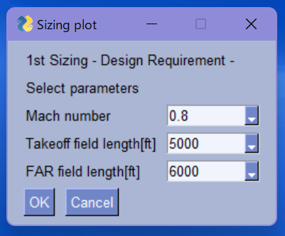
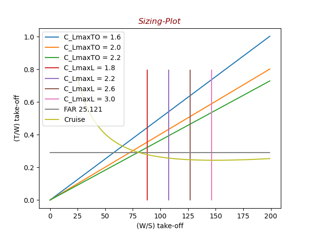

Initial version: 2022/01/05
Revised: 2021/

# Conceptual aircraft design

---

## Contents

---

- [Conceptual aircraft design](#conceptual-aircraft-design)
  - [Contents](#contents)
  - [1. Abstract](#1-abstract)
  - [2. Directory Structure](#2-directory-structure)
  - [3. Requirements](#3-requirements)
  - [4. Make usage](#4-make-usage)
  - [Reference](#reference)
  - [License](#license)

## 1. Abstract

---

[](p=paragraph)
<p align="center">

</p>

<div align="center">
Fig.1 Set parameters
</div>

<p align="center">

</p>

<div align="center">
Fig.2 Sizing plot simulation
</div>

- 1st sizing:

  This code shows the sizing plot graph. The sizing plot can be estimated aircraft parameters such that Thrust-Weight ratio, Weight-Wing area ratio on taking off.

## 2. Directory Structure

---

```Shell
aircraft-design
├── LICENSE
├── Makefile                      # make ref. chapter 4 (Make Usage)
├── README.md
├── docker/
|  ├── Dockerfile
|  ├── wslg/
|  |  └── Docker-compose-wslg.yml
|  └── xserver/
|     └── Docker-compose-xserver.yml
├── docker-compose.yml
├── docs/
|  ├── i18n/
|  |  ├── en/
|  |  |  └── docker.md
|  |  └── jp/
|  |     └── docker.md
|  └── images/
|     └── wslg.png
├── img/
|  └── Fig1.png
├── out.txt
├── poetry.lock
├── pyproject.toml
├── scripts/
|  ├── set-wslg.sh
|  └── set-xserver.ps1
└── src/                         # source code
   └── 1st-sizing/
      ├── W-takeoff.f90          # initial sizing for maximum take-off weight
      └── sizeplt-gui.py         # sizing plot with the GUI module PySimpleGUI

directory: 12 file: 18
```

## 3. Requirements

---

- python 3.7.x or 3.8.x
- poetry(package maneger):

If you do not have `poetry` installed, you can install it with the following command.

```shell
pip install poetry
make install-dev
```

if you use Anaconda3

```shell
conda install -c conda-forge poetry
make install-dev
```

More info is [here.](https://raw.githubusercontent.com/python-poetry/poetry/master/install)

If you use Docker, see below please.

[how to use docker](docs/i18n/en/docker.md)

## 4. Make usage

---

default:
make = make start

| Command            | Description                                               |
| :----------------- | :-------------------------------------------------------- |
| `make start`       | Run python file(default: `src/1st-sizing/sizeplt-gui.py`) |
| `make install-dev` | Install dependencies (For dev)                            |
| `make install`     | Install dependencies (For prod)                           |
| `make test`        | Test with pytest                                          |
| `make lint`        | Lint with pysen                                           |
| `make lint-fix`    | Lint fix with pysen                                       |
| `make clean`       | Remove `__pycache__` files                                |

If you are using windows, you can install the `make` command
[here](http://gnuwin32.sourceforge.net/packages/make.htm). (Click the `Setup`
button at the top.)

## Reference

---

[1] Kenichi Rinoie, "Aircraft Design method -
conceptual design from single pulloperant to SST - "

[2] Daniel P.Raymer, Aircraft Design: A Conceptual Approach (AIAA Education Series), Sixth Edition

## License

MIT
