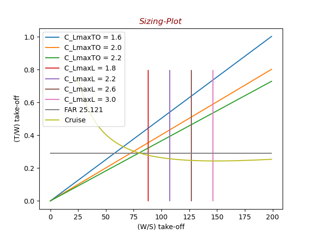

Initial version: 2022/01/05
Revised: 2021/

# Conceptual aircraft design

---

## Contents

---

- [Conceptual aircraft design](#conceptual-aircraft-design)
  - [Contents](#contents)
  - [1. Abstract](#1-abstract)
  - [2. Directory Structure](#2-directory-structure)
  - [3. Requirements](#3-requirements)
  - [4. Make usage](#4-make-usage)
  - [Reference](#reference)

## 1. Abstract

---

- 1st sizing

[](p=paragraph)
<p align="center">


</p>

<div style="text-align: center;">

  This code shows the sizing plot graph. The sizing plot can be estimated aircraft parameters such that Thrust-Weight ratio, Weight-Wing area ratio on taking off.

## 2. Directory Structure

---

.
├── Makefile            # make ref. chapter 4 (Make Usage)
└── src                 # source code
        ├── sizeplt-gui.py          # sizing plot with the GUI module PySimpleGUI
        └── W-takeoff.f90           # initial sizing for maximum take-off weight

## 3. Requirements

---

- python 3.8 &lt; 3.10
- poetry(package maneger):

If you do not have `poetry` installed, you can install it with the following command.

```shell
pip install poetry
```

if you use Anaconda3

```shell
conda install -c conda-forge poetry
```

More info is [here.](https://raw.githubusercontent.com/python-poetry/poetry/master/install)

## 4. Make usage

---
default:
make = make run

| Command    |              Description               |
| :--------- | :------------------------------------: |
| `make run` | Run python file(default: `src/run.py`) |

## Reference

---

[1] Kenichi Rinoie, "Aircraft Design method -
         conceptual design from single pulloperant to SST - "

[2] Daniel P.Raymer, Aircraft Design: A Conceptual Approach (AIAA Education Series), Sixth Edition
