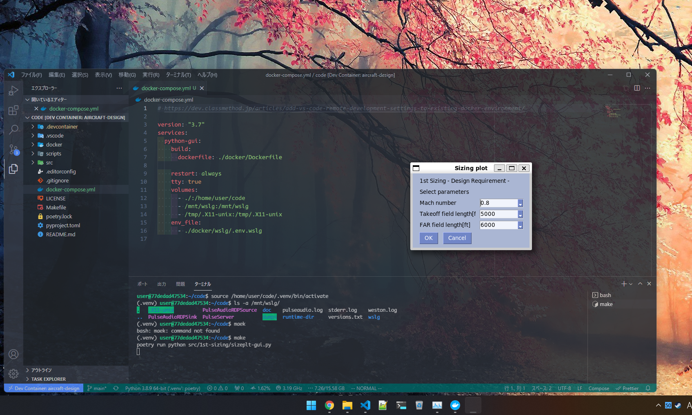

# Docker

English | [日本語](../jp/docker.md)



- [aircraft-design](#aircraft-design)

  - [Requirements](#requirements)
    - [local PC](#local-pc)
    - [Docker](#docker)
  - [development](#development)
  - [Make usage](#make-usage)
  - [License](#license)

- WSLg(if you use Windows11) or X server.

## development

### when use Docker(WSLg)

1.The following commands are used to build the image.

```bash
git clone https://github.com/DiaSird/aircraft-design.git
code aircraft-design
```

2.press F1, select `Reopen in Container...`.
Please wait a moment.This is going to take some time.

### when use Docker(X server)

1.The following commands are used to build the image.

```bash
git clone https://github.com/DiaSird/aircraft-design.git
cd aircraft-design
make compose-x
code .
```

2.press F1, select `Reopen in Container...`.
Please wait a moment.This is going to take some time.

3.Start the X server.
